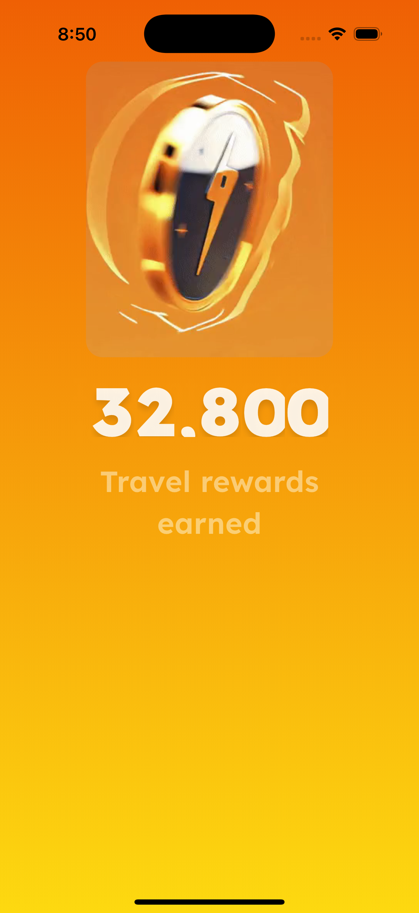
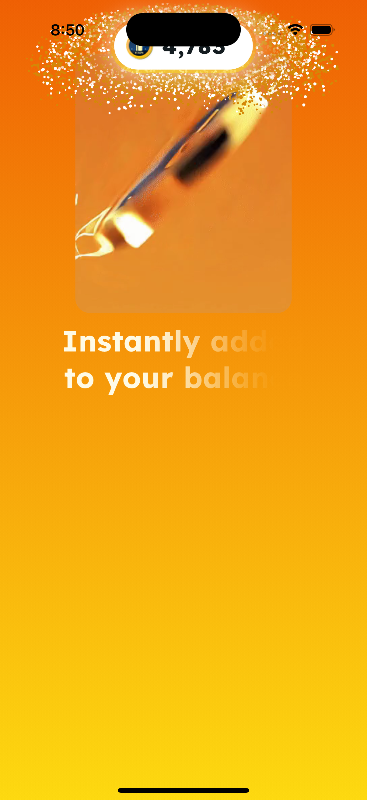
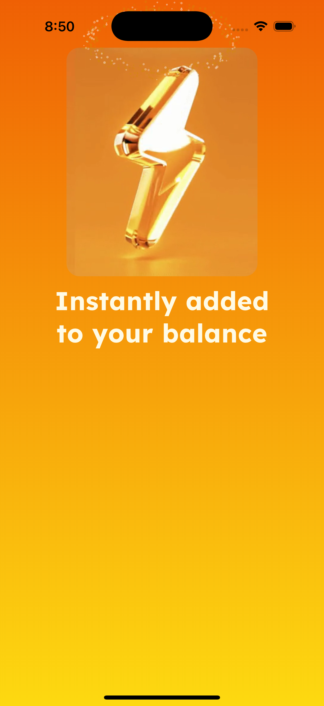
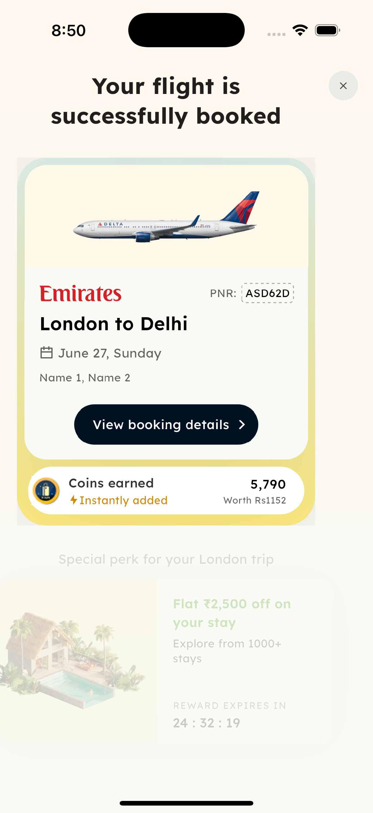

# Coins Transition

A pixel-faithful **Flutter port** of a post-booking *"travel rewards earned"* animation that was originally prototyped in **SwiftUI**. The sequence counts up the coins you earned, disintegrates that number into a cloud of glyph-shaped particles that stream into a balance pill, and then flies your booked-flight card onto the screen with a curved-sheet warp.

> [!IMPORTANT]
> **This branch (`coins-transition-v2-aurora`) updates the SwiftUI side only.**
> `Vacations/` now carries the cinematic as it stands in the main *My trips*
> prototype: roughly twice the code, with an aurora that floods the screen
> behind a travelling glass beam, two maintained variants, and per-booking-kind
> artwork. The Flutter port in `vacations_flutter/` and the values in
> [`FLUTTER_PORT_SPEC.md`](FLUTTER_PORT_SPEC.md) still track the **older**
> SwiftUI version described below, so the two are no longer in lock-step.
> Everything under "The sequence" and "What makes it interesting" describes
> that older version.

This repository keeps **both** implementations side by side — the original SwiftUI prototype and the Flutter re-implementation — plus an exhaustive, value-for-value [porting spec](FLUTTER_PORT_SPEC.md) so the two stay in lock-step.

<p align="center">
  
  
  
  
</p>

---

## The sequence

The whole thing is one timed, non-interactive cinematic (~8.5s) driven by a single async routine. It runs in three phases:

1. **Earned** — an orange→yellow screen. A Scapia coin video spins and morphs into an energy bolt while **32,800** rolls into place ticker-style under *"Travel rewards earned."*
2. **Added** — the number **disintegrates into particles, Apple-Wallet style**. The particles are sampled from the *actual rasterized glyphs* of "32,800", so the cloud is the shape of the number. They stream up into a balance pill that springs in and counts to **5,790**, while *"Instantly added to your balance"* wipes in left-to-right and a glassy shine sweeps the pill border.
3. **Trip** — a crossfade to the booked-flight card ("London → Delhi"), which flies up from below with a **bottom-anchored sinusoidal warp** (a Metal shader in Swift, a GLSL fragment shader in Flutter), followed by a hotel offer card with a live countdown.

---

## Repository layout

```
.
├── Vacations/                       # Original SwiftUI prototype (Xcode project)
│   └── Vacations/
│       ├── TripAnnouncementViewV2.swift   # the screen: layout + master timeline
│       ├── CoinsVariant.swift             # the two maintained variants
│       ├── AuroraWave.swift               # the travelling glass beam
│       ├── GlassWave.metal                # its refraction / specular / halo
│       ├── CardWarpShader.metal           # card entrance distortion
│       ├── RewardHaptics.swift            # ticker burst + continuous rumble
│       ├── Theme.swift, DesignTokens.swift # colors + Lexend Deca weights
│       ├── BackDeploy.swift               # iOS 16 fallbacks
│       └── LoopingVideoView.swift, CoinRewards.mp4
│
├── vacations_flutter/               # The Flutter port
│   ├── lib/
│   │   ├── trip_announcement_v2.dart      # screen: layout + the master timeline
│   │   ├── particle_dissolve.dart         # glyph-shaped particle system
│   │   ├── glyph_sampler.dart             # rasterizes digits → pixel cloud
│   │   ├── rolling_number.dart            # ticker digits
│   │   ├── entrance_effect.dart           # cubic-keyframe card entrance
│   │   ├── spring.dart                    # SwiftUI spring → Flutter SpringSimulation
│   │   ├── design_tokens.dart             # ported colors + fonts
│   │   └── haptics.dart
│   ├── shaders/card_warp.frag             # GLSL port of CardWarpShader.metal
│   └── assets/                            # images, video, font (copied from Swift)
│
├── FLUTTER_PORT_SPEC.md             # value-for-value spec (every color, size, delay, curve)
└── docs/screenshots/                # the images above
```

---

## What makes it interesting

| Effect | How it's done |
|---|---|
| **Glyph-shaped particle dissolve** | The digits "32,800" are rasterized offscreen (Lexend Deca Black, 64pt), and every opaque pixel becomes ~3 particles. A bottom-to-top wave converts the solid number into the cloud in step with a mask that "eats" the text. Rendered each frame in a `CustomPainter`. |
| **Card warp entrance** | A fragment shader bows the card along `cos(y·π/2)` — anchored at the bottom edge, max bend at the top — resolving to flat as the entrance completes. Combined with a 3D X-axis tilt, scale, fly-up offset and fade. |
| **Faithful motion** | SwiftUI `spring(response:dampingFraction:)` is converted to a Flutter `SpringSimulation` via `stiffness = (2π/response)²`. SwiftUI `CubicKeyframe` tracks are reproduced with a cubic **Hermite spline** (rest at the ends, Catmull-Rom momentum through interior keyframes) rather than a per-segment approximation. |
| **Exact values** | Every color hex, font size/weight, dimension, padding, radius, animation duration, delay and curve is copied verbatim from the Swift source and documented in [`FLUTTER_PORT_SPEC.md`](FLUTTER_PORT_SPEC.md). |

---

## Running the Flutter app

Requires Flutter 3.41+ (Dart 3.11+).

```bash
cd vacations_flutter
flutter pub get
flutter run            # pick an iOS simulator or Android emulator
```

Verified on the iOS Simulator (iPhone 16 Pro) and Android emulator (API 35, Impeller).

> **Tip:** in *debug* mode Android shows the Flutter splash for a few seconds during cold start (JIT + asset warm-up); a `--release` build starts near-instantly. The animation timeline itself is identical on both platforms.

### Running the SwiftUI prototype

Open `Vacations/Vacations.xcodeproj` in Xcode and run on an iOS simulator. The app starts directly on `TripAnnouncementViewV2` and the sequence plays once on appear. Nothing navigates — the card's "View booking details" and offers pill are no-ops here.

Two variants of the sequence are maintained, both always built (see `CoinsVariant.swift`). A plain Run gives `refined` — the particle dissolve and the aurora. For the other:

```bash
xcrun simctl launch <udid> kushal.Vacations -coinsVariant classic
```

`classic` drops the particle cloud (the number just fades) and replaces the aurora with three drifting gradient blooms that leave upward. The confirmation celebrates a flight by default; `-bookingKind stay|experience|train|bus` exercises the other artwork.

#### Known issue on this branch

`makeDissolveDots()` rasterizes the hardcoded string `"32,800"` while the screen now shows **27,053** — the amount changed in the prototype and the sampler was never updated. Both are `dd,ddd`, so the cloud still lands in the right place at the right size and the effect reads as intended, but the particles are the shape of a *different* number. Left as-is here so the branch stays a faithful snapshot of the prototype.

---

## Fidelity notes

The port is value-for-value with two intentional, documented deviations:

- **Corners** use `BorderRadius.circular` rather than Apple's `.continuous` superellipse (Flutter's `ContinuousRectangleBorder` doesn't match Apple's curvature 1:1).
- **3D perspective** in the card entrance uses an approximate Flutter matrix term for SwiftUI's `perspective: 1.0`.
- **Haptics** are best-effort: Flutter can't set impact intensity or a CoreHaptics continuous rumble without a platform channel.

Everything else — colors, type, geometry, timing, springs, the particle cloud parameters, the warp math — matches the source. See the spec for the complete mapping and acceptance criteria.

---

## Tech

- **Flutter** (Material), `video_player`, `flutter_svg`, `flutter_shaders`
- **GLSL** fragment shader (`flutter/runtime_effect.glsl`, runs on Impeller)
- **Lexend Deca** variable font (weights selected via `fontVariations`)
- Original: **SwiftUI** + **Metal** distortion shader + **Core Haptics**
